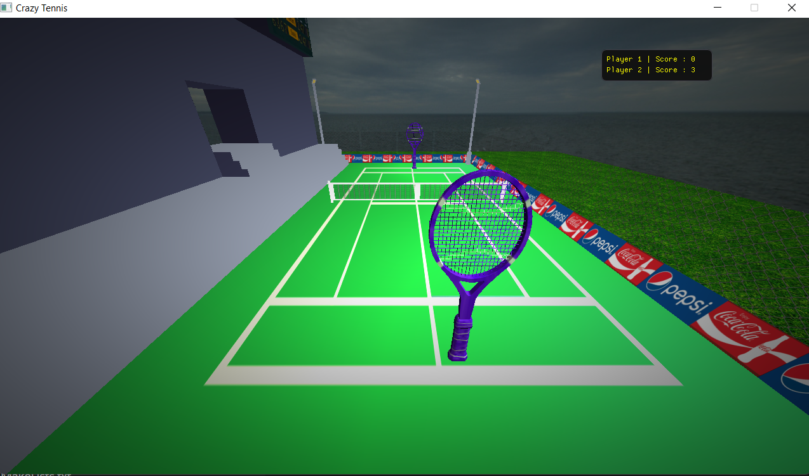

# Crazy Tennis Game

<p align="center">
  <a href="" rel="noopener">
 </a>
</p>
<p align="center">
    <br> 
</p>
<div align="center">

[](https://github.com/Eagle-Hunting-Game/contributors)
[](https://github.com/gaserashraf/Eagle-Hunting-Game/issues)
[](https://github.com/gaserashraf/Eagle-Hunting-Game/network)
[](https://github.com/gaserashraf/Eagle-Hunting-Game/stargazers)
[](https://github.com/gaserashraf/Eagle-Hunting-Game/blob/master/LICENSE)

</div>

## About

It is two player game played with rackets and a crazy ball behavior and light for a clear view try to score and avoid the ball falling into the water.

## 🏁 Get Started <a name = "Install"></a>
1. **Clone the repository**
```
git clone https://github.com/Yousif-Ahmed/Crazy-Tennis
```
2. **Install Visual Studio Code**


3. **Open the folder in Visual Studio Code**


4. **Build the project**


4. **Open a terminal (Terminal > New Terminal)**


5. **Run this Command**
```
.\bin\GAME_APPLICATION.exe -c="config\test_app.jsonc"
```

## 💻 Built Using <a name = "tech"></a>
- [C++]()
- [OpenGL](https://www.opengl.org/)

## 🎮How to play

### For Player 1

- Use *←* to move left.
- Use *→* to move right.
- Use *↑* to move front.
- Use *↓* to move back.

## For Player 2

- Use *A* to move left.
- Use *D* to move right.
- Use *W* to move front.
- Use *S* to move back.

## 📷 Screenshots

<div name="Screenshots" align="center">
   
   <hr>
    
    <hr>
   
   <hr>
   
   <hr>
</div>
